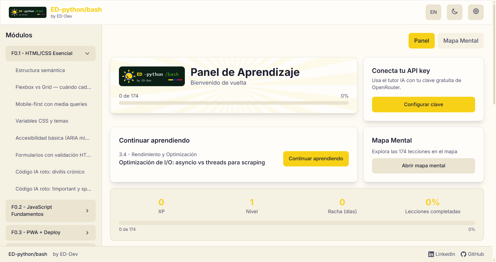

# ED-python/bash Learning App


PWA para aprender Python y Bash de forma interactiva, por ED-Dev. Diseño solarpunk con acentos tricolor, portada bento y videos de instrucción generados por la propia app.



## Características

- **174 lecciones** en 19 módulos (F0-F3), con contenido enriquecido por IA
- **Portada bento**: hero con progreso tricolor, continuar, stats, videos y mapa mental
- **Videos de instrucción**: 3 guías generadas por la app, con voz y descargas WebM/HTML
- **Tutor IA con tu propia clave**: cada usuario usa su key gratuita de OpenRouter (se guarda solo en su navegador)
- **Código roto → corregido → optimizado**: debugging real con resaltado de sintaxis
- **Quizzes con gating**: aprobar con ≥70% para completar la lección
- **Simulador**: Python (Pyodide/WASM) y Bash reales, retos con asserts + XP
- **Video generativo**: efecto "code typing" con ASCII 3D + TTS
- **Bilingüe**: español e inglés · **Temas**: light solar / dark bosque
- **PWA offline**: instalable, progreso local (IndexedDB/localStorage), XP y rachas

## Tu propia API key (tutor IA)

1. Crea una key gratuita en [openrouter.ai/keys](https://openrouter.ai/keys)
2. En la app, abre **Configuración** (engranaje) → pega tu key → Guardar
3. Listo: el tutor IA de cada lección usa tus modelos gratuitos

La key nunca sale de tu navegador (solo viaja a OpenRouter en tus propias llamadas).

## Inicio rápido

```bash
npm install
npm run dev -- --port 5174   # desarrollo
npm run build                # build producción (dist/)
npm run test                 # unit tests (Vitest)
npm run test:e2e             # E2E (Playwright)
npm run lint                 # lint
```

### Enriquecimiento IA (batch local, opcional)

```bash
$env:OPENROUTER_API_KEY = "sk-or-..."
node scripts/enrich-all.mjs --limit 2   # probar con 2
node scripts/enrich-all.mjs             # todas las pendientes
```

Idempotente (salta lecciones con `_enriched: true` y `quiz_ia` completo).
Límites gratis de OpenRouter: 50 requests/día; el loop programado
(`ED-PythonBash-EnrichLessons` cada 30 min) avanza solo.

## Deploy (Vercel)

```bash
vercel --prod
```

Build: `npm run build` → `dist/`. No necesita rewrites (HashRouter).
Cada usuario desplegado usa su propia API key (ver arriba): el repo no
incluye ninguna clave.

## Stack

React 19 + Vite 8 · Tailwind 4 + CSS variables · Zustand · react-router-dom 7
(HashRouter) · react-markdown + Prism · Pyodide (WASM) · i18next · Canvas API
(video + ASCII 3D) · Vitest + Playwright · vite-plugin-pwa (Workbox)

## Estructura

```
src/
  components/     # atoms/ molecules/ organisms/ + lesson/ quiz/ simulator/ video/ audio/ dashboard/
  pages/          # Dashboard (bento)
  store/          # Zustand: progress, theme, language
  i18n/           # ES/EN
  lib/            # parser, pyodide, bashSim, videoEngine, tutorScript/Export/Recorder, instructionVideos
  data/modulos/   # 31 archivos JSON con lecciones
  types/          # lesson.ts (Lesson, TutorStep, Module...)
  services/       # pyodide singleton, bashSim, questionGenerator
scripts/          # enrich-all.mjs + enrich-loop.ps1 (batch IA)
```

## Licencia

MIT
